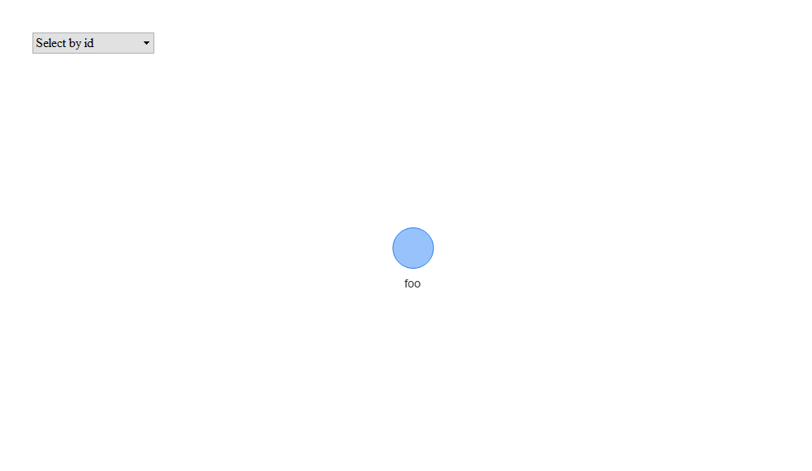

# `template.package`

<!-- badges: start -->

<!-- badges: end -->

Boilerplate for ‘tidylab’
Packages

-----

<!-- Package Description -->

## Overview

Using this template reduces:  
\* Unnecessary variance between packages configurations; and  
\* Development time spent on making a barebone package working for the
first time.  
This is possible as the template comes with:  
\* Fully configured test-suite, including code-coverage; and  
\* Fully configured continuous-integration (CI) script for Travis.

<!--- Only relevant for the {boilerplate} package -->

## Useage

1.  Create a new repo on GitHub.
2.  Use the
    [`git-flow`](https://blog.sourcetreeapp.com/2012/08/01/smart-branching-with-sourcetree-and-git-flow/)
    approach in your development cycle.
3.  Create a new release named `inception`.
4.  Copy `template.package` content to the new reposetory.
5.  Change the `template.package.Rproj` file to `<package-name>.Rproj`.
6.  Open the `DESCRIPTION` file, and edit the following fields:
7.  **Package** modify the package name while using the `tidylab.`
    prefix.
8.  **Title** modify the package title; use uppercase words with no
    period (‘.’).
9.  **URL** modify the package URL such that it leads to its GitHub
    repo.
10. **BugReports** edit the URL such that it leads to the package issue
    page.
11. **Description** modify the package decription.
12. In `README.Rmd` delete the **Useage** Section.
13. Render `README.Rmd` by clicking the **Knit** button.
14. Push changed on the `inception` branch.
15. Go to [Travis website](https://travis-ci.org/account/repositories),
    add the project and enable its integration.
16. Decide if you would need binder – an RStudio Server that lets you
    demonstrate the package. If you do then:

<!-- end list -->

  - Uncomment *build-binder* under *.travis.yml*; and
  - Uncomment *Launch Rstudio Binder* from README.Rmd.

## Installation

You can install `template.package` by using:

    install.packages("devtools")
    devtools::install_github("tidylab/template.package")

## Function Dependencies

